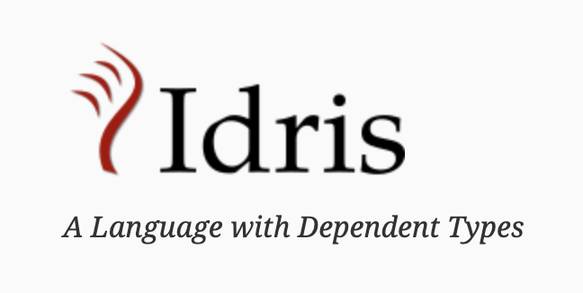

# <b>Idris</b> とは

    <b>依存型</b>という機構を持つ正格評価の純粋関数型言語 
    研究目的で開発されており、実装には Haskell が使われている

    

---

import ListItem from '../components/list-item'

# Haskell の型と値

    <ul>
        <ListItem><code>Int</code> 型の値 <code>1</code></ListItem>
        <ListItem><code>Char</code> 型の値 <code>'Z'</code></ListItem>
        <ListItem><code>[Char]</code> 型の値 <code>"abc"</code></ListItem>
    </ul>
    
明確な対応関係が存在する

